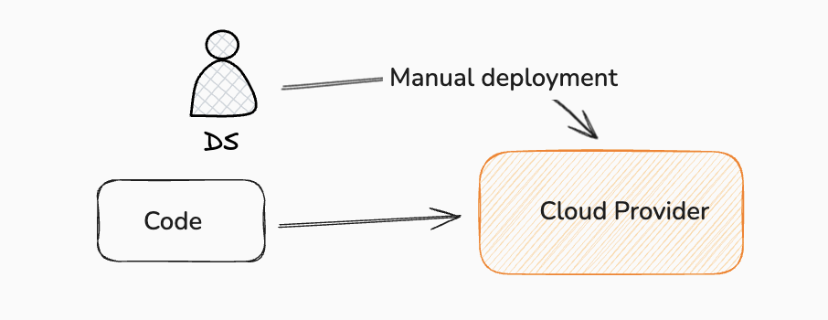
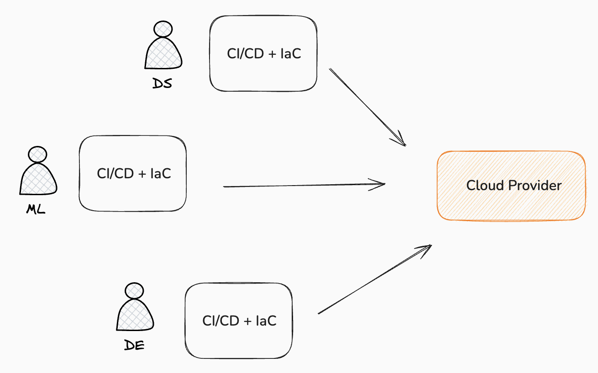
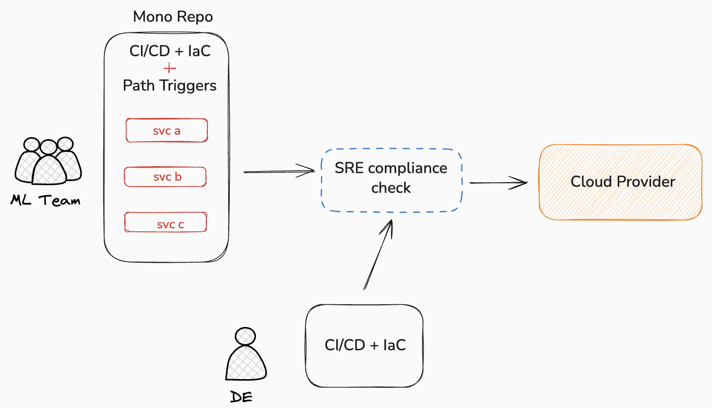
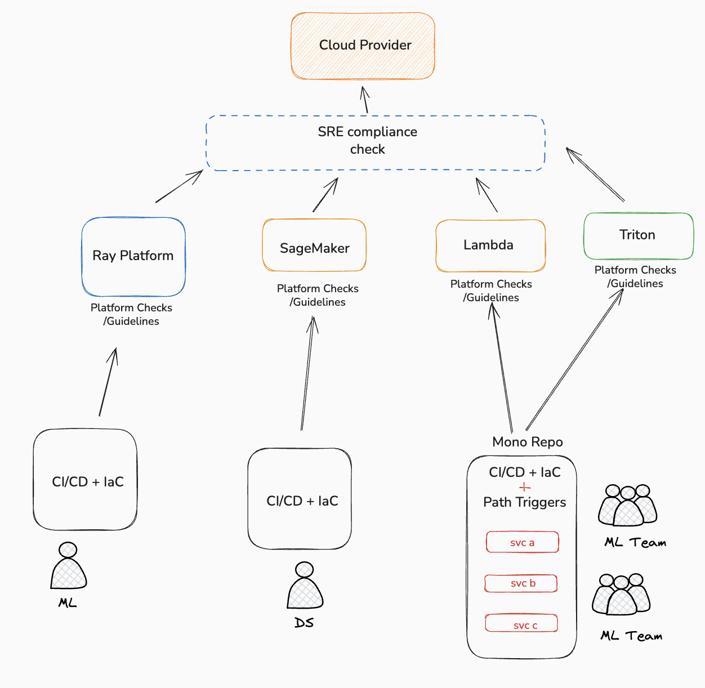

Defining strong CI/CD guidelines is an interesting task when building projects or infrastructure from zero.
In this article, I share some recommendations based on my experience working with both startups and large enterprises.

---

## From Single Repos to Monorepos: A Practical Journey

When starting a new project, the first decision is usually how to structure the repository:

- **Single repo:** All code for one project stored in a single repository.  
- **Monorepo:** Multiple projects living within one unified repository.

In early-stage startups, one repo per project is usually the simplest and fastest approach. We keep the code, pipelines, and infrastructure together, and that’s often the right call.

Here’s an example of a typical ML project structure that I like to use for simple projects:

```
some-ai-project
├── .pipelines/              # CI/CD pipelines
│   ├── build.groovy
│   └── deploy.groovy
├── infrastructure/          # IaC
│   └── cloudformation.yaml
├── src/                     # Source code
│   ├── __init__.py
│   ├── handler.py           # Entry point
│   ├── classifier.py        # Main logic
│   └── config/
│       └── patterns.txt
├── tests/                   # Tests
│   ├── __init__.py
│   ├── conftest.py
│   ├── test_classifier.py
│   └── fixtures/
│       └── *.xhtml
├── azure-pipelines.yml
├── requirements.txt
├── requirements-dev.txt
└── pyproject.toml
```
Some projects can work very well with this way of deployment for a good time.
Operations are trivial when maintaining a single service. In fact, probably we don't need CI/CD, CloudFormation, etc. Services are easy and not much traffic, we could do something like this:


---

While technically imperfect, this approach optimizes for velocity the only metric that matters in early-stage startups
I saw some projects that worked like that, but let's start complicating things:


## Scaling Up: When Teams Grow

Imagine the startup begins to grow. New talent and more experienced engineers start joining, and KT sessions appear for helping junior engineers structuring their services. New teams and projects start being proposed by the business, so each engineer within the same team or different ones starts being responsible for their service. We end up with a decentralized structure like this:



This setup helps teams **move fast**, but it also comes with challenges:

- Everyone deploys from different repos.
- Standards may vary between engineers.
- Infrastructure decisions become inconsistent.

It works… until it doesn't.

---

## The Bob Scenario: Why Monorepos Start Making Sense

Now imagine *Bob*, an entry-level engineer, needs to deploy a simple service.  
Creating an entire repository just for that small function feels like overkill — and it is.

He asks a staff engineer for guidance, and the proposal is simple:

**“Let’s start moving toward a monorepo.”**

The idea:

- One repository  
- Multiple project folders preferably from the same vertical
- Each with its own services and pipelines  
- Shared tooling and standards

Yep, Monorepo sounds good, but it also has disadvantages. Some of those are that it could be difficult to define standards and guidelines at the start, and we have to find ways to ensure all developers will follow those guidelines. The staff engineer is in charge of defining those.

"The monorepo isn't just about folders; it's about atomic changes across services and shared governance"

With new cloud engineers joining, SRE standards also start to appear: naming conventions, IaC templates, deployment rules, etc. Suddenly the monorepo becomes a natural evolution.

We end up with something like this:



Until now, previous definitions will be useful for any company with lots of projects and services, but let's go for the next level that is more focused on ML platforms...

---


## Enterprise Scale: Platform Thinking

Now let's fast-forward.

We’re no longer dealing with a few projects — we’re managing **dozens or even hundreds**. Different teams deploy different types of models: SageMaker, batch jobs, real-time inference, distributed training, etc.

And each team deploys differently.  
Some follow best practices. Others don't.

This is where **platform engineering** becomes essential.

We start defining:

- ✅ Standard guidelines  
- ✅ Reusable resources  
- ✅ Vetted Infrastructure Templates (IaC)
- ✅ Shared tools  
- ✅ Operational requirements (SRE)

Examples of what we standardize:

- Artifact lifecycle management
- S3 data layouts 
- Rollout strategies  
- Autoscaling policies
- Monitoring + Observability  
- Security policies  

At this level, the monorepo becomes a **platform**, not just a repo.

Here’s what that can look like:




## Final Thoughts


Each diagram above represents a massive amount of work.  
A well-implemented monorepo can support **thousands of services** if the platform beneath is strong.

The architecture you choose is a function of your constraints:

1. **Start simple:** Single repo.  
2. **Grow with structure:** Monorepo.  
3. **Evolve into a platform:** Standards, tooling, and reusable patterns.

What matters is not the shape of the repo it’s how effectively teams can ship, maintain, and scale software.

The goal isn't to build the most complex system, but to build the system that allows your team to ship value with the least friction.
