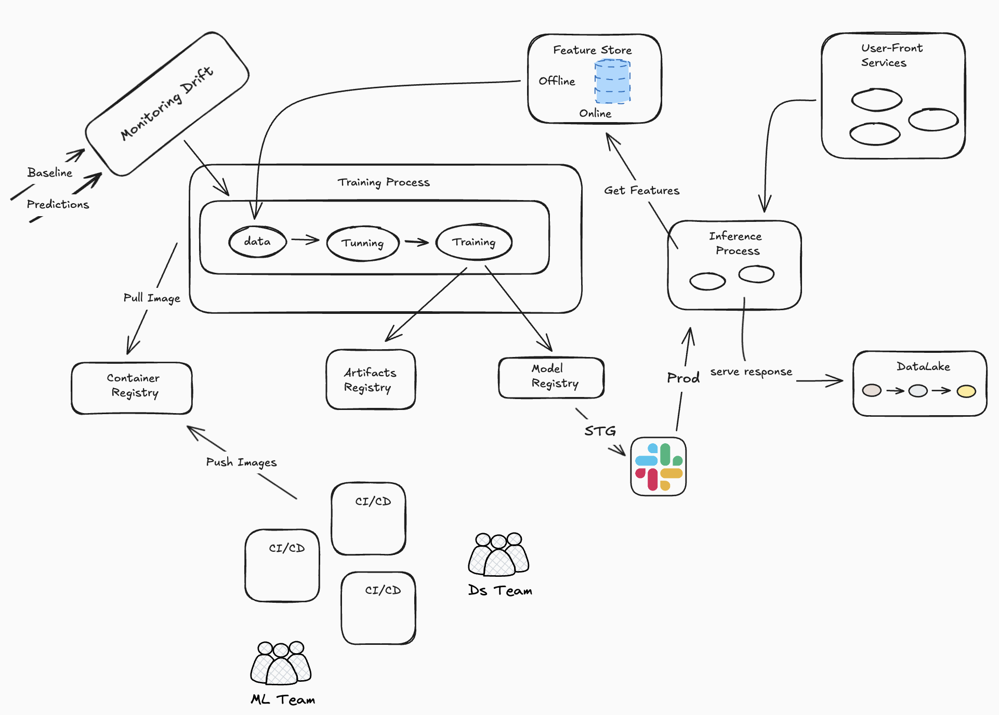

Building a platform from scratch is ultimately about **standardization** and **developer experience**.

## The Problem

How do small companies go from scrappy startup to unicorn-level operations?

We all know the pattern: early-stage teams, especially in ML and DS, prioritize *speed* over *robustness*.  
Ship features → hit deadlines → experiment fast. Best practices come later.

But what happens when the company starts raising bigger rounds, scaling operations, hiring dozens of new engineers, and introducing more requirements?

Suddenly:
- Every mid-level engineer can deploy a FastAPI model.  
- But **not every engineer can deploy a FastAPI model that is scalable, observable, reproducible, and ready for fast iteration.**

That's where I stepped in.

I needed to define a new, unified way to deploy all models across three teams in the company.

---

## Understanding the Business Need

“Let’s build a huge MLOps platform!”  
Easy to say. But reality is different.

Before writing a single line of code or drafting epics, we had to ask the right questions:

- What does the business actually need *right now*?  
- How much time do we have to build core components internally?  
- Should we assemble an open-source stack ourselves?  
- Or adopt a Platform-as-a-Service like Weights & Biases, H2O, or Databricks?  
- Is a hybrid approach more feasible?

After several weeks of conversations with stakeholders, directors, and the CTO, we narrowed down the options:

1. Fully internal platform built on open-source  
2. Open-source + PaaS mix  
3. Full PaaS platform  

After evaluating cost, maintainability, and time-to-value…

### We chose a hybrid infrastructure.

Some components would be managed by a PaaS, and others would remain internal.

---

## The First Platform Proposal

We drafted our first platform architecture using open-source components.  
It looked like this:

For each component, we created user stories and defined clear acceptance criteria.

We built:
- Common containers  
- Monitoring and model drift tools  
- Documentation for every stage of training and deployment  

We also defined the entire end-to-end process:
- branching strategy (trunk-based vs gitflow)  
- CI/CD steps required to validate new model trainings  
- ingestion of logs and metrics into the datalake for long-term analysis  

This allowed the company to scale model deployments predictably and consistently.
